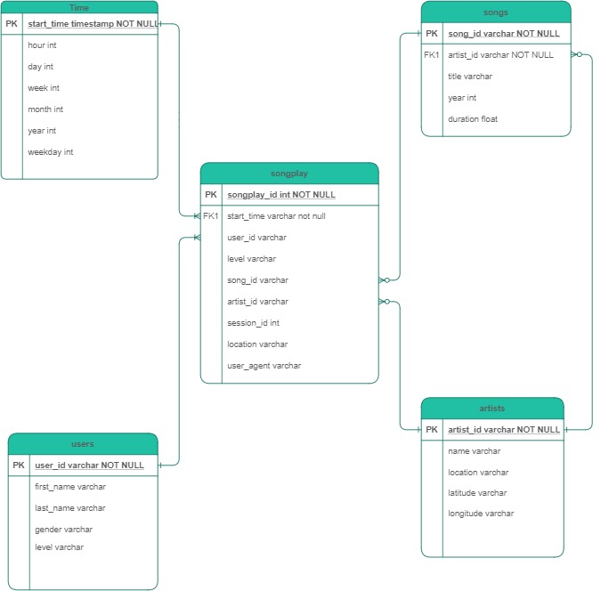
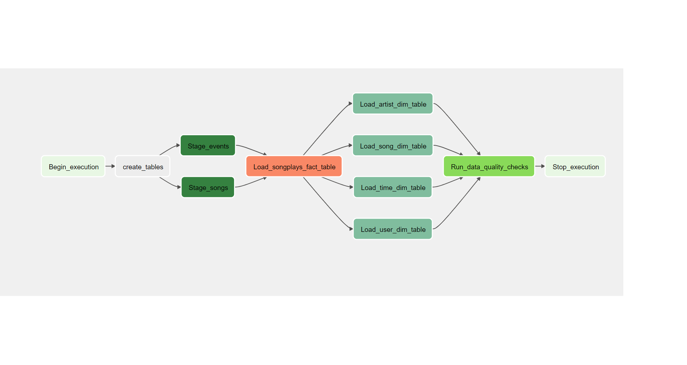

# Project Summary!
***
## Introduction
***
A music streaming startup, Sparkify, has grown their user base and song database and want to move their processes and data onto the cloud. Their data resides in S3, in a directory of JSON logs on user activity on the app, as well as a directory with JSON metadata on the songs in their app.

As their data engineer, you are tasked with building an ETL pipeline that extracts their data from S3, stages them in Redshift, and transforms data into a set of dimensional tables for their analytics team to continue finding insights in what songs their users are listening to. You'll be able to test your database and ETL pipeline by running queries given to you by the analytics team from Sparkify and compare your results with their expected results.

***
## Technology Stack
***
This Project uses following open source technologies to work properly:

* [postgreSQL](https://www.postgresql.org/download/) - RDBMS Data Store, Amazon Redshift is technology based on postgreSQL but userf for OLAP (Online Analytical Processing)
* [Amazon Redshift](https://docs.aws.amazon.com/redshift/index.html/) - Amazon Redshift is a fully managed, petabyte-scale data warehouse service in the cloud. An Amazon Redshift data warehouse is a collection of computing resources called nodes, which are organized into a group called a cluster. Each cluster runs an Amazon Redshift engine and contains one or more databases.
* [Python](https://www.python.org/downloads/release/python-360/) - Programming language used in this project to build ETL pipelines and following are the libraries used in the project:
    -  [ConfigParser](https://pymotw.com/2/ConfigParser) - Use the ConfigParser module to manage user-editable configuration files for an application. The configuration files are organized into sections, and each section can contain name-value pairs for configuration data. Value interpolation using Python formatting strings is also supported, to build values that depend on one another (this is especially handy for URLs and message strings).
    -  [psycopg2](https://pypi.org/project/psycopg2/) - Psycopg is the most popular PostgreSQL database adapter for the Python programming language. This same adapter can be used to connect to Redshift cluster.
***
## Databsae ER Diagram:
***

***
### Code Deliverables:
***

1. **dwh.cfg** Its a configuration file which can be used to configure Redshift cluster credentials and S3 file paths.
2. **sql_queries.py** contains all sql queries which are executed to insert data.
3. **create_tables.py** drops and creates your tables.
4. **sparkify_etl_dag.py** Apache Airflow dag file defining the tasks and sequence. 
5. **stage_redshift.py** Custom Oprator used in the sparkify dag to copy files from S3 to redshift table.
6. **load_dimension.py** Custom Oprator used in the sparkify dag to copy files from staging to dimension redshift table. 
7. **load_fact.py** Custom Oprator used in the sparkify dag to copy files from staging to redshift fact  table.
8. **data_quality.py** Custom operator for running data quality checks on the dataset passed. 
9. **Create Or Delete Redshift Cluster.ipynb** Notebook to create Redshift cluster using AWS SDK. This cluster is used to test the pipeline on S3 and Redshift.
10. **README.md** provides discussion on your project.

***
## Airflow Pipeline Visual Representation:
***

***
### Build and Test on local environment
***
1. Build a local airflow environment using [airflow docker image](https://airflow.apache.org/docs/apache-airflow/stable/start/docker.html)
2. Create AWS Redshift cluster using **Create Or Delete Redshift Cluster.ipynb** notebook.
3. Run DAG from Airflow UI.

### License

None